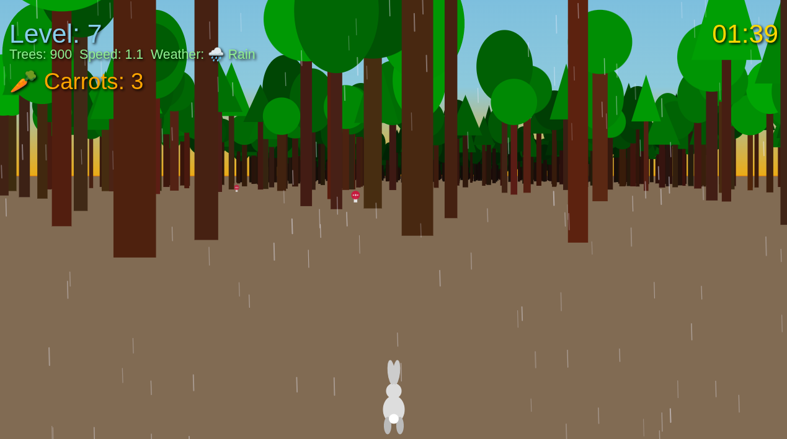

# 🐇 Run, Rabbit, Run

### Run, Rabbit, Run — простая аркадная игра в жанре endless runner, написанная на чистом JavaScript без фреймворков и библиотек.

Игрок управляет кроликом, убегающим через лес. Со временем скорость растёт, а деревьев становится всё больше. Собирайте морковки, чтобы набрать очки, и мухоморы, чтобы замедлить кролика.

Играть [https://suvorovsergey.github.io/run-rabbit-run/](https://suvorovsergey.github.io/run-rabbit-run/)

### Управление

**Основное управление:**
- ← / → — движение влево / вправо
- Space — пауза
- Esc — выход в главное меню

**Дополнительные клавиши:**
- C — активировать/деактивировать noclip режим (прохождение сквозь деревья на 3 минуты)
- S — сменить тему оформления
- R — включить/выключить дождь
- F — включить/выключить туман

**Мобильное управление:**
- Левая треть экрана — движение влево
- Правая треть экрана — движение вправо

### Запуск

- Самый простой способ запуска — VS Code Live Server.
- Установите расширение Live Server для VS Code
- Откройте проект в VS Code
- Кликните правой кнопкой по index.html
- Выберите “Open with Live Server”

- Игра откроется в браузере автоматически.

### Стек

- JavaScript (ES6 modules)
- HTML5 Canvas
- Без фреймворков и внешних библиотек
